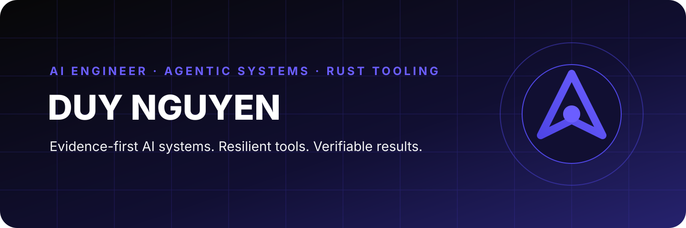

<p align="center">
  
</p>

<p align="center">
  <a href="https://vaic-2026-production.up.railway.app"><strong>PolicyRadar Live</strong></a>
  ·
  <a href="https://skills.sh/clownnvd/task-mitosis/task-mitosis"><strong>Agent Skills</strong></a>
  ·
  <a href="https://www.linkedin.com/in/duy-nguyen-bbb267338"><strong>LinkedIn</strong></a>
</p>

## Hey there! I'm Duy Nguyen 👋

**AI Engineer · Agentic Systems Builder · Rust Toolmaker**

I build AI products where retrieval, tool calls, state transitions, and human decisions remain visible and testable. My current work focuses on grounded RAG, multi-agent workflows, data observability, developer agents, and small native tools that survive real operating conditions.

- 🤖 Building **evidence-first agentic systems** with LangGraph, RAG, MCP, A2A, deterministic guards, citations, and human review.
- 🧭 Developing **GrantFinder AI**, a source-aware workflow for matching funding calls and preparing application packages without inventing missing facts.
- 🛠️ Publishing reusable **Agent Skills** for task decomposition, TDD, code review, UI verification, and README engineering.
- 🦀 Shipping native **Rust** tools for search, speech-to-text, video workflows, and NTFS disk inspection.
- 🎓 Learning and building through the **VinUni Applied AI Program 2026 — Cohort 4** in Hanoi, Vietnam.

## Highlights

- 🥉 **R2AI Stage 2 — Third Prize (Top 3)** with team **KINGPRO** — [official result repository](https://github.com/aigurutinix/r2ai-stage-2/blob/2bbc3a43cb29bfaf8aa53da15be5699b4af1b8d2/README.md#2-k%E1%BA%BFt-qu%E1%BA%A3-cu%E1%BB%99c-thi--danh-s%C3%A1ch-c%C3%A1c-%C4%91%E1%BB%99i)
- 🏆 **Vietnam AI Innovation Challenge 2026 — Top 5 overall + FPT Award** with **PolicyRadar** — [USTH coverage](https://usth.edu.vn/32449-32449/)

## Selected work

### [PolicyRadar](https://github.com/Clownnvd/vaic-2026)

An evidence-first policy and grant navigator for Vietnamese businesses. The system combines deterministic eligibility rules, legal citations, semantic retrieval, freshness monitoring, and guarded LLM explanations.

- **Result:** Top 5 overall and FPT Award at Vietnam AI Innovation Challenge 2026 — [USTH coverage](https://usth.edu.vn/32449-32449/)
- **Stack:** Next.js 16, React 19, FastAPI, FAISS, OpenAI, Railway, GitHub Actions
- **Demo:** [vaic-2026-production.up.railway.app](https://vaic-2026-production.up.railway.app)

### [GrantFinder AI](https://github.com/Clownnvd/grantfinder-ai-edu10)

A source-first research-funding assistant that connects opportunity discovery to proposal completion: application-package mapping, eligibility checks, field-level evidence, deterministic validation, citations, and human approval gates.

- **Stack:** LangGraph, FastAPI, Next.js, PostgreSQL, pgvector, BM25
- **Focus:** NAFOSTED and Grants.gov workflows, including call-specific forms and Word review exports

### Agent engineering toolkit

| Project | What it does |
|---|---|
| [task-mitosis](https://github.com/Clownnvd/task-mitosis) | Decomposes complex goals into bounded, dependency-aware, verifiable tasks |
| [proofsmith](https://github.com/Clownnvd/proofsmith) | Moves a change from specification through red-green-refactor to fresh evidence |
| [code-sentinel](https://github.com/Clownnvd/code-sentinel) | Reviews production changes across correctness, security, performance, tests, and maintainability |
| [shipshape-ui](https://github.com/Clownnvd/shipshape-ui) | Applies product-specific UI contracts and real-browser quality gates |
| [readme-forge](https://github.com/Clownnvd/readme-forge) | Creates evidence-backed repository front pages with deterministic audits |
| [skills-sh-publisher](https://github.com/Clownnvd/skills-sh-publisher) | Packages, publishes, updates, and verifies Agent Skills on GitHub and skills.sh |

### Native and systems tools

| Project | Core stack | Purpose |
|---|---|---|
| [megasearch](https://github.com/Clownnvd/megasearch) | Rust · mmap · MCP | Literal-search CLI and MCP server with trigram/Bloom prefiltering |
| [diskinv](https://github.com/Clownnvd/diskinv) | Rust · NTFS MFT · MCP | Fast raw NTFS inventory for disk analysis |
| [diskinv-gui](https://github.com/Clownnvd/diskinv-gui) | Rust · egui | Native disk inventory and safe-cleanup interface |
| [capcut-stt](https://github.com/Clownnvd/capcut-stt) | Rust · egui · STT | Desktop transcription and subtitle export workflow |
| [vidgrab-app](https://github.com/Clownnvd/vidgrab-app) | Rust · egui · yt-dlp | Native interface for discovering and downloading public short-form video |

## Tech stack

<p>
  
</p>

| Area | Tools and practices |
|---|---|
| **AI & agents** | LangGraph · RAG · MCP · A2A · tool calling · HITL · embeddings · cross-encoder reranking |
| **Retrieval & data** | BM25 · FAISS · pgvector · ChromaDB · Sentence Transformers · Great Expectations · Prefect |
| **Backend** | Python · FastAPI · Pydantic · PostgreSQL · SQLite · REST APIs |
| **Frontend** | TypeScript · Next.js 16 · React 19 · Tailwind CSS 4 · pnpm |
| **Native systems** | Rust · egui · memory-mapped files · NTFS MFT · CLI/MCP tooling |
| **Delivery & quality** | Docker · Railway · Vercel · RunPod Serverless · GitHub Actions · pytest · Playwright |

## How I work

```text
Go to the source
→ define the contract
→ build the smallest complete path
→ measure the result
→ keep failures and limitations visible
→ turn repeated manual work into tests, gates, or tools
```

I prefer systems that can explain what they used, what they rejected, what remains uncertain, and how another person can reproduce the result.

## What I'm working on now

- Grant-call ingestion, EDA, monitoring, custom reranking, and form-package workflows
- Multi-agent orchestration with typed handoffs and evidence-scoped tools
- Reusable quality gates for coding agents and frontend delivery
- Fast local utilities that expose both CLI and MCP interfaces

## 🤝 How to reach me

- GitHub: [@Clownnvd](https://github.com/Clownnvd)
- LinkedIn: [duy-nguyen-bbb267338](https://www.linkedin.com/in/duy-nguyen-bbb267338)
- Email: [magicduy56@gmail.com](mailto:magicduy56@gmail.com)
- Agent Skills: [skills.sh/clownnvd](https://skills.sh/clownnvd/task-mitosis/task-mitosis)

---

<p align="center">
  <sub>Build the evidence trail with the product.</sub>
</p>
